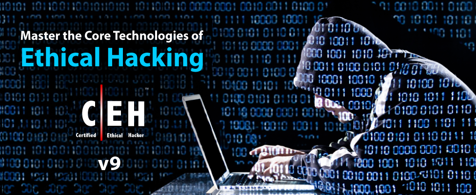

# EC Council Certified Ethical Hacker v9.0

##### Instructor: Keith Barker
##### Course URL: [CBTNuggets](https://www.cbtnuggets.com/it-training/ceh-certified-ethical-hacker-v9)
##### Release Date: 2016

This Certified Ethical Hacker (CEH) v9.0 video training course teaches you the ethical hacking tools and techniques needed to improve your network's security posture. CBT Nuggets trainer Keith Barker walks you through building your own practice lab, including using evaluation software, and encourages you to not only watch and enjoy the videos, but practice everything hands-on in your own lab environment.

For individuals interested in certification, watching and practicing the techniques taught in this course prepares you for EC-Council Certified Ethical Hacker (CEH) exam. Please visit the EC Council website for their requirements and procedures for taking the exam.

---

- **Recommended Experience**
  - Networking fundamentals (CompTIA Network+ level of knowledge or better)
  - Familiarity with multiple versions of Windows
  - Familiarity with Linux is not necessary but recommended
  - Familiarity with VMware Workstation
  - Knowledge of Networking and Security at the CompTIA Network+ and Security+ levels, or better
- **Recommended Equipment**
  - Host running VMware Workstation, that can support 64bit VMs.
- **Related Certifications**
  - Certified Ethical Hacker v9 (#312-50)
- **Related Job Functions**
  - Network/System Administrators/Engineers
  - Security officers
  - Auditors
  - Security professionals
  - Site administrators
  - Those concerned about the security of the network infrastructure

---

## Lab Information

| Machine             | IP Address    | Account       | Password      |
|---------------------|---------------|---------------|---------------|
| Kali Linux          | 192.168.1.109 | root          | NuggetLab123! |
| Windows 8.1         | 192.168.1.208 | Administrator | NuggetLab123! |
| Windows 10          | 192.168.1.210 | Administrator | NuggetLab123! |
| Windows Server 2012 | 192.168.1.212 | Administrator | NuggetLab123! |
| Windows Server 2016 | 192.168.1.212 | Administrator | NuggetLab123! |

- Domain name : `nuglab.local`
- NetBios name: `NUGLAB`
- Domain Controller: 192.168.1.212
- Directory Services Password: `NuggetLab123!`

| Domain Account   | Domain       | Password   |
|------------------|--------------|------------|
| lois             | nuglab.local | Simple123  |

---

## Progress

- [x] [Lesson 001 - Welcome](Lessons/Lesson 001/README.md)
- [x] [Lesson 002 - Building a LAB: Concepts](Lessons/Lesson 002/README.md)
- [x] [Lesson 003 - Building a LAB: Networking](Lessons/Lesson 003/README.md)
- [x] [Lesson 004 - Deploy a Kali Linux VM](Lessons/Lesson 004/README.md)
- [x] [Lesson 005 - Adding Metasploitable to Your Lab](Lessons/Lesson 005/README.md)
- [x] [Lesson 006 - Adding Windows to Your Lab](Lessons/Lesson 006/README.md)
- [x] [Lesson 007 - Configure a Static IP on Kali](Lessons/Lesson 007/README.md)
- [x] [Lesson 008 - Windows Evaluations](Lessons/Lesson 008/README.md)
- [x] [Lesson 009 - Deploy Windows 8.1](Lessons/Lesson 009/README.md)
- [x] [Lesson 010 - Deploy Windows 2012](Lessons/Lesson 010/README.md)
- [x] [Lesson 011 - Deploy Windows 10](Lessons/Lesson 011/README.md)
- [x] [Lesson 012 - Deploy Windows 2016](Lessons/Lesson 012/README.md)
- [x] [Lesson 013 - Ethics and Hacking](Lessons/Lesson 013/README.md)
- [x] [Lesson 014 - Hacking Vocabulary](Lessons/Lesson 014/README.md)
- [x] [Lesson 015 - InfoSec Concepts](Lessons/Lesson 015/README.md)
- [x] [Lesson 016 - Attack Categories, Types, and Vectors](Lessons/Lesson 016/README.md)
- [x] [Lesson 017 - Five Phases of Hacking](Lessons/Lesson 017/README.md)
- [x] [Lesson 018 - Footprinting and Reconnaissance Concepts](Lessons/Lesson 018/README.md)
- [x] [Lesson 019 - Search Engine Tools](Lessons/Lesson 019/README.md)
- [x] [Lesson 020 - Hacking using Google](Lessons/Lesson 020/README.md)
- [x] [Lesson 021 - Website Recon Tools](Lessons/Lesson 021/README.md)
- [x] [Lesson 022 - Metagoofil Metadata Tool](Lessons/Lesson 022/README.md)
- [x] [Lesson 023 - Email Headers for Footprinting](Lessons/Lesson 023/README.md)
- [x] [Lesson 024 - Using WHOIS for Recon](Lessons/Lesson 024/README.md)
- [x] [Lesson 025 - DNS Tools](Lessons/Lesson 025/README.md)
- [x] [Lesson 026 - Network Scanning Overview](Lessons/Lesson 026/README.md)
- [x] [Lesson 027 - Network Scanning Methodology](Lessons/Lesson 027/README.md)
- [x] [Lesson 028 - Port Discovery](Lessons/Lesson 028/README.md)
- [x] [Lesson 029 - Network Scanning Tools](Lessons/Lesson 029/README.md)
- [x] [Lesson 030 - Stealth Idle Scanning](Lessons/Lesson 030/README.md)
- [x] [Lesson 031 - OS and Application Fingerprinting](Lessons/Lesson 031/README.md)
- [x] [Lesson 032 - Vulnerability Scanning](Lessons/Lesson 032/README.md)
- [x] [Lesson 033 - Network Mapping Tools](Lessons/Lesson 033/README.md)
- [x] [Lesson 034 - Proxy Servers](Lessons/Lesson 034/README.md)
- [x] [Lesson 035 - Using Public Proxy Services](Lessons/Lesson 035/README.md)
- [x] [Lesson 036 - Enumeration Concepts](Lessons/Lesson 036/README.md)
- [x] [Lesson 037 - NetBIOS Enumeration](Lessons/Lesson 037/README.md)
- [x] [Lesson 038 - SNMP Enumeration Concepts](Lessons/Lesson 038/README.md)
- [x] [Lesson 039 - SNMP Enumeration Tools](Lessons/Lesson 039/README.md)
- [x] [Lesson 040 - LDAP Enumeration Concepts](Lessons/Lesson 040/README.md)
- [x] [Lesson 041 - LDAP Enumeration Example](Lessons/Lesson 041/README.md)
- [x] [Lesson 042 - NTP Enumeration](Lessons/Lesson 042/README.md)
- [x] [Lesson 043 - SMTP Enumeration](Lessons/Lesson 043/README.md)
- [x] [Lesson 044 - System Hacking Overview](Lessons/Lesson 044/README.md)
- [x] [Lesson 045 - Password Cracking Concepts](Lessons/Lesson 045/README.md)
- [x] [Lesson 046 - Password Attack Example: MITM and Sniffing](Lessons/Lesson 046/README.md)
- [x] [Lesson 047 - Rainbow Crack Lab Setup](Lessons/Lesson 047/README.md)
- [x] [Lesson 048 - Rainbow Crack Demonstration](Lessons/Lesson 048/README.md)
- [x] [Lesson 049 - Password Reset Hacking](Lessons/Lesson 049/README.md)
- [x] [Lesson 050 - DHCP Starvation](Lessons/Lesson 050/README.md)
- [x] [Lesson 051 - Remote Access](Lessons/Lesson 051/README.md)
- [x] [Lesson 052 - Spyware](Lessons/Lesson 052/README.md)
- [ ] [Lesson 053 - NTFS Alternate Data Streams Exploit](Lessons/Lesson 053/README.md)
- [ ] [Lesson 054 - Steganography with OpenPuff](Lessons/Lesson 054/README.md)
- [ ] [Lesson 055 - Steganography with SNOW](Lessons/Lesson 055/README.md)
- [ ] [Lesson 056 - Covering Tracks](Lessons/Lesson 056/README.md)
- [ ] [Lesson 057 - Malware Overview](Lessons/Lesson 057/README.md)
- [ ] [Lesson 058 - Trojan Overview](Lessons/Lesson 058/README.md)
- [ ] [Lesson 059 - Creating a Trojan](Lessons/Lesson 059/README.md)
- [ ] [Lesson 060 - Virus Overview](Lessons/Lesson 060/README.md)
- [ ] [Lesson 061 - Virus Creation](Lessons/Lesson 061/README.md)
- [ ] [Lesson 062 - Detecting Malware](Lessons/Lesson 062/README.md)
- [ ] [Lesson 063 - Malware Analysis](Lessons/Lesson 063/README.md)
- [ ] [Lesson 064 - Hash File Verification](Lessons/Lesson 064/README.md)
- [ ] [Lesson 065 - Sniffing Overview](Lessons/Lesson 065/README.md)
- [ ] [Lesson 066 - CAM Table Attack and Port Security](Lessons/Lesson 066/README.md)
- [ ] [Lesson 067 - DHCP Snooping](Lessons/Lesson 067/README.md)
- [ ] [Lesson 068 - Dynamic ARP Inspection (DAI)](Lessons/Lesson 068/README.md)
- [ ] [Lesson 069 - Social Engineering](Lessons/Lesson 069/README.md)
- [ ] [Lesson 070 - Denial of Service (DoS) Attacks](Lessons/Lesson 070/README.md)
- [ ] [Lesson 071 - Session Hijacking](Lessons/Lesson 071/README.md)
- [ ] [Lesson 072 - Hacking Web Servers](Lessons/Lesson 072/README.md)
- [ ] [Lesson 073 - Buffer Overflow](Lessons/Lesson 073/README.md)
- [ ] [Lesson 074 - OWASP Broken Web Application Project](Lessons/Lesson 074/README.md)
- [ ] [Lesson 075 - Shellshock](Lessons/Lesson 075/README.md)
- [ ] [Lesson 076 - SQL Introduction](Lessons/Lesson 076/README.md)
- [ ] [Lesson 077 - SQL Injection](Lessons/Lesson 077/README.md)
- [ ] [Lesson 078 - Web App Vulnerabilities: WordPress](Lessons/Lesson 078/README.md)
- [ ] [Lesson 079 - Wireless Hacking](Lessons/Lesson 079/README.md)
- [ ] [Lesson 080 - Using an Android VM](Lessons/Lesson 080/README.md)
- [ ] [Lesson 081 - Malware for Mobile](Lessons/Lesson 081/README.md)
- [ ] [Lesson 082 - Mobile Device Risks and Best Practices](Lessons/Lesson 082/README.md)
- [ ] [Lesson 083 - Firewall Evasion](Lessons/Lesson 083/README.md)
- [ ] [Lesson 084 - Firewall ACL Example](Lessons/Lesson 084/README.md)
- [ ] [Lesson 085 - NAT and PAT fundamentals](Lessons/Lesson 085/README.md)
- [ ] [Lesson 086 - IDS/IPS Evasion](Lessons/Lesson 086/README.md)
- [ ] [Lesson 087 - Honeypots](Lessons/Lesson 087/README.md)
- [ ] [Lesson 088 - Cloud Computing](Lessons/Lesson 088/README.md)
- [ ] [Lesson 089 - CIA: Confidentiality, Integrity, and Availability](Lessons/Lesson 089/README.md)
- [ ] [Lesson 090 - Policies](Lessons/Lesson 090/README.md)
- [ ] [Lesson 091 - Quantifying Risk](Lessons/Lesson 091/README.md)
- [ ] [Lesson 092 - Separation of Duties](Lessons/Lesson 092/README.md)
- [ ] [Lesson 093 - Symmetrical Encryption Concepts](Lessons/Lesson 093/README.md)
- [ ] [Lesson 094 - Asymmetrical Encryption Concepts](Lessons/Lesson 094/README.md)
- [ ] [Lesson 095 - Control Types](Lessons/Lesson 095/README.md)
- [ ] [Lesson 096 - Multifactor Authentication](Lessons/Lesson 096/README.md)
- [ ] [Lesson 097 - Centralized Identity Management](Lessons/Lesson 097/README.md)
- [ ] [Lesson 098 - Kerberos and Single Sign On (SSO)](Lessons/Lesson 098/README.md)
- [ ] [Lesson 099 - Backups and Media Management](Lessons/Lesson 099/README.md)
- [ ] [Lesson 100 - Operations Security Controls](Lessons/Lesson 100/README.md)
- [ ] [Lesson 101 - Physical Security Controls](Lessons/Lesson 101/README.md)
- [ ] [Lesson 102 - Incident Response](Lessons/Lesson 102/README.md)
- [ ] [Lesson 103 - VPNs](Lessons/Lesson 103/README.md)
- [ ] [Lesson 104 - Disaster Recovery Planning](Lessons/Lesson 104/README.md)
- [ ] [Lesson 105 - Pen Testing Tips](Lessons/Lesson 105/README.md)
- [ ] [Lesson 106 - Useful Tools](Lessons/Lesson 106/README.md)
- [ ] [Lesson 107 - Case Study](Lessons/Lesson 107/README.md)
- [ ] [Lesson 108 - Additional Resources and Exam Prep](Lessons/Lesson 108/README.md)

---

## Resources
- [EC Council - Certified Ethical Hacking Certification](https://www.eccouncil.org/programs/certified-ethical-hacker-ceh/)

