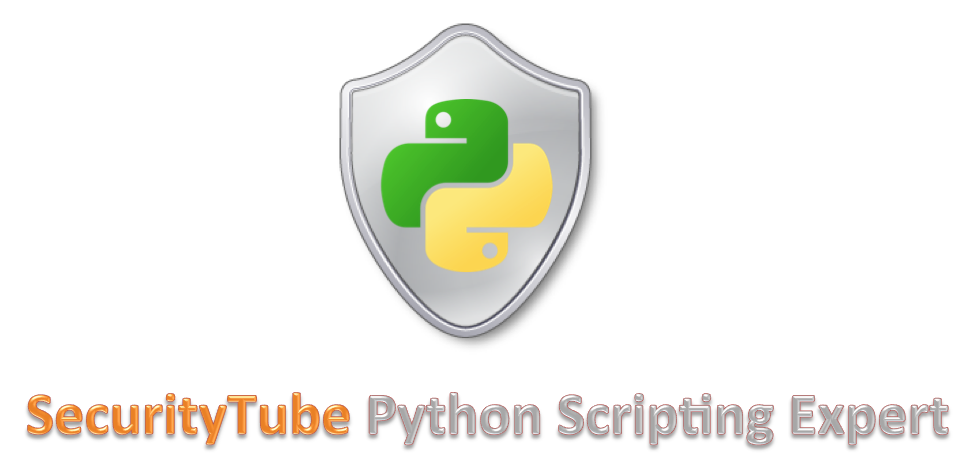

# SecurityTube: Python Scripting Expert

##### Instructor: Vivek Ramachandran
##### Course URL: [SecurityTube](http://www.securitytube-training.com/online-courses/securitytube-python-scripting-expert/)
##### Release Date: May 2012

## Progress

- [X] [Module 01: Python Language Essentials](Modules/Module 01/README.md)
- [ ] [Module 02: System Programming](Modules/Module 02/README.md)
- [ ] [Module 03: Network Security](Modules/Module 03/README.md)
- [ ] [Module 04: Attacking Web Applications](Modules/Module 04/README.md)
- [ ] [Module 05: Exploitation Techniques](Modules/Module 05/README.md)
- [ ] [Module 06: Reverse Engineering](Modules/Module 06/README.md)
- [ ] [Module 07: Automation in Python](Modules/Module 07/README.md)
- [ ] [Module 08: Further Study and Projects](Modules/Module 08/README.md)
- [ ] [Module 09: Exam Pattern and Mock Exam](Modules/Module 09/README.md)

## Resources
- [Python Homepage](https://www.python.org/)
